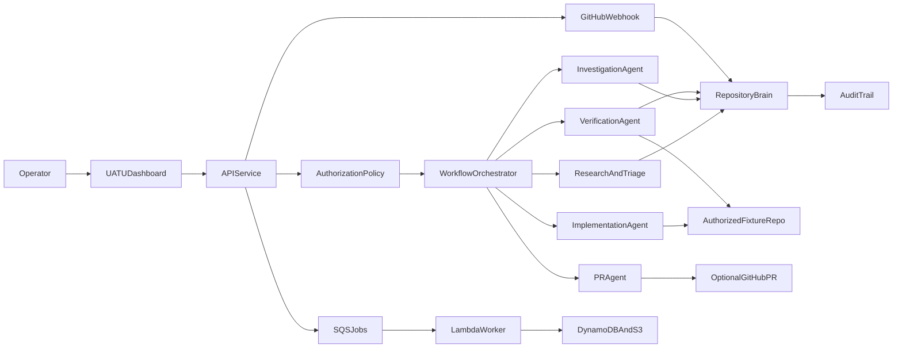

# UATU

**Universal Autonomous Triage & Upkeep**

**Observe. Understand. Repair. Contribute.**

UATU is an autonomous open-source engineering and security research agent that analyzes an *authorized* repository, builds a persistent repository Brain, investigates bugs and dependency risks, applies minimal verified fixes, and contributes reviewable GitHub pull requests (or local PR artifacts when GitHub credentials are unset).

This repository ships a **complete MVP vertical slice**: local-first execution with deterministic rule-based decisions (Amazon Bedrock optional), optional live GitHub PR open, GitHub webhook ingestion for PR events, plus an AWS CDK (TypeScript) path for API, worker, storage, and dashboard hosting.

---

## What this MVP proves

1. Explicit authorization before any write.
2. Repository Brain (neurons + typed synapses + evidence/confidence).
3. Bounded remediation state machine with immutable audit events.
4. Two authorized fixture scenarios:
   - Functional bug: `inclusiveRange` off-by-one in `fixtures/demo-vulnerable`.
   - Dependency security: deliberately pinned outdated `left-pad@1.0.1`.
5. Isolated command runner (allowlist, timeout, redaction).
6. Local branch + commit + PR artifact; optional live GitHub PR when `UATU_GITHUB_TOKEN` and `UATU_GITHUB_REPO` are set.
7. Operator dashboard for authorize → run → inspect → verify → contribute.
8. Cost-conscious AWS CDK stack (OpenSearch / Step Functions / multi-repo Brain deferred as stretch).
9. Fixture issue import (`ISSUES.json`) and optional GitHub Issues API import into the Brain.
10. GitHub webhook endpoint (`POST /api/webhooks/github`) to record PR lifecycle observations.

---

## Architecture



### Package layout

| Path | Role |
|------|------|
| `packages/domain` | Shared types, schema version, legal state transitions |
| `packages/core` | Policy, audit/redaction, Brain, persistence, command runner, workflow |
| `apps/api` | Local HTTP API + CLI demo |
| `apps/web` | React operator dashboard |
| `fixtures/demo-vulnerable` | Sole authorized write target for the MVP |
| `infra/cdk` | AWS CDK Ship It stack |

---

## Safety model

- **Passive by default.** Inspect/analyze do not require a grant; writes do.
- Writes are denied unless:
  - An authorization grant exists for the fixture path.
  - Requested capability is present (`write_files`, `create_branch`, `commit`, `draft_pr`, `run_tests`).
  - Target path is inside the authorized fixture root.
  - Commands match the grant allowlist.
- Secrets matching token patterns are redacted from audit/command output.
- Live GitHub PR creation is **not** performed in this MVP.

---

## Local run

### Prerequisites

- Node.js 20+
- Git available on `PATH`

### Install

```bash
npm install
npm run build -w @uatu/domain -w @uatu/core
```

### Environment

Copy `.env.example` values as needed. Bedrock stays off unless `UATU_BEDROCK_ENABLED=true`.

Optional live GitHub contribution:

```text
UATU_GITHUB_TOKEN=<fine-grained or classic PAT with repo + pull request scopes>
UATU_GITHUB_REPO=owner/name
UATU_GITHUB_BASE_BRANCH=main
UATU_GITHUB_WEBHOOK_SECRET=<optional shared secret for /api/webhooks/github>
```

Without those variables the e2e loop still completes with a local PR-ready artifact and state `PR_ARTIFACT_READY`. With them configured, UATU pushes the remediation branch and opens a real PR (`PR_CREATED`).

### Headless demo (end-to-end)

```bash
npm run demo
```

Expected final task state: `PR_ARTIFACT_READY` (or `PR_CREATED` when GitHub live mode is configured) with passing verification and a local branch under `uatu/…`.

The API copies `fixtures/demo-vulnerable` into an isolated sandbox at `data/sandbox/demo-vulnerable` (own `.git`) so writes never touch the parent monorepo history.

### API + dashboard

```bash
npm run dev:api
npm run dev:web
```

- API: http://localhost:8787/health  
- UI: http://localhost:5173  

Dashboard flow:

1. **Authorize fixture**
2. **Start run** (Brain init + findings)
3. Select a finding
4. **Run to PR artifact**
5. Inspect neural map, audit trail, verification, and PR body

---

## Tests

```bash
npm test
```

Coverage includes:

- Legal state transitions (`@uatu/domain`)
- Policy denials and secret redaction (`@uatu/core`)
- Full remediation integration against a temp fixture copy (`@uatu/api`)
- CDK resource assertions (`@uatu/infra`)

---

## AWS Ship It (CDK)

Stack resources (least privilege, encrypted storage, 14-day log retention):

- API Gateway HTTP API → API Lambda
- SQS job queue (+ DLQ) → Worker Lambda
- DynamoDB tasks/audit metadata
- S3 artifact bucket
- EventBridge bus
- CloudFront + private S3 origin for the dashboard
- **No OpenSearch** in this vertical slice

### Synthesize

```bash
cd infra/cdk
npx cdk synth
```

### Diff / deploy

Requires AWS credentials (set `AWS_PROFILE` or your preferred auth), CDK bootstrap in your project Region, and a review of `cdk diff` before deploy. For the new AWS experience, use the Region shown under AWS Settings (this repo defaults `CDK_DEFAULT_REGION` to `ap-south-1` when unset):

```powershell
cd infra/cdk
$env:CDK_DEFAULT_REGION="ap-south-1"   # or your project Region
$env:AWS_PROFILE="YOUR_AWS_PROFILE"
npx cdk diff
npx cdk deploy
```

After deploy, build and sync the web app (take `WebBucketName` and `ApiUrl` from CDK outputs):

```powershell
$env:VITE_UATU_API_URL="<ApiUrl from cdk outputs>"
npm run build -w @uatu/web
aws s3 sync apps/web/dist s3://$WEB_BUCKET_NAME --profile $env:AWS_PROFILE
```

If credentials are missing, leave the stack synth-ready and do not deploy.

Lambda packaging: API and worker are bundled from `apps/api/src/lambda-api.ts` and `lambda-worker.ts` via CDK `NodejsFunction`, including a copy of `fixtures/demo-vulnerable` as `fixture-seed`.

### Cost notes

- On-demand DynamoDB and Lambda keep idle cost near zero.
- CloudFront + S3 are pay-per-use.
- Avoid enabling Bedrock/OpenSearch until needed.

---

## Demo script (~3 minutes)

1. Show failing expectation in `fixtures/demo-vulnerable` (`inclusiveRange` / outdated dep).
2. Authorize via dashboard or `npm run demo`.
3. Brain initializes; findings appear with evidence.
4. Run remediation; patch + regression path; verification PASS.
5. Show audit trail and neural map activation.
6. Show local branch + PR artifact (and live PR URL when GitHub is configured).
7. Show CDK synth outputs / architecture briefly.

---

## Configuration reference

| Variable | Purpose |
|----------|---------|
| `UATU_DATA_DIR` | Local JSON persistence root (default `./data`; Lambda uses `/tmp/uatu-data`) |
| `UATU_FIXTURE_SEED` | Read-only seed copied into the sandbox (default `./fixtures/demo-vulnerable`) |
| `UATU_FIXTURE_PATH` | Writable sandbox path (default `data/sandbox/demo-vulnerable`) |
| `UATU_API_PORT` | API port (default `8787`) |
| `UATU_CORS_ORIGIN` | Dashboard origin |
| `UATU_BEDROCK_ENABLED` | Optional LLM path |
| `UATU_BEDROCK_MODEL_ID` | Bedrock model id when enabled |
| `TASKS_TABLE` / `ARTIFACT_BUCKET` | When set, API uses DynamoDB + S3 instead of JSON files |
| `JOB_QUEUE_URL` | When set with async jobs, `/api/tasks/:id/run` enqueues the worker |
| `CDK_DEFAULT_ACCOUNT` / `CDK_DEFAULT_REGION` | CDK env (project Region for new AWS experience) |

---

## Known MVP limitations

- Single authorized fixture; no multi-repo org brain.
- Live GitHub PR / webhook ingestion deferred.
- Bedrock path is optional stub-safe; rules drive demo-critical decisions.
- Dashboard hosting expects a post-deploy `s3 sync` of `apps/web/dist`.
- Deployed remediation runs in Lambda `/tmp` against the bundled fixture seed (not a live GitHub clone).
- Explicit `cdk deploy` confirmation required; do not deploy from CI without review.

---

## License / contribution

Licensed under the [MIT License](./LICENSE) (SPDX: `MIT`).

Ship It MVP: treat the fixture as the only write target unless you extend the policy grants deliberately.
