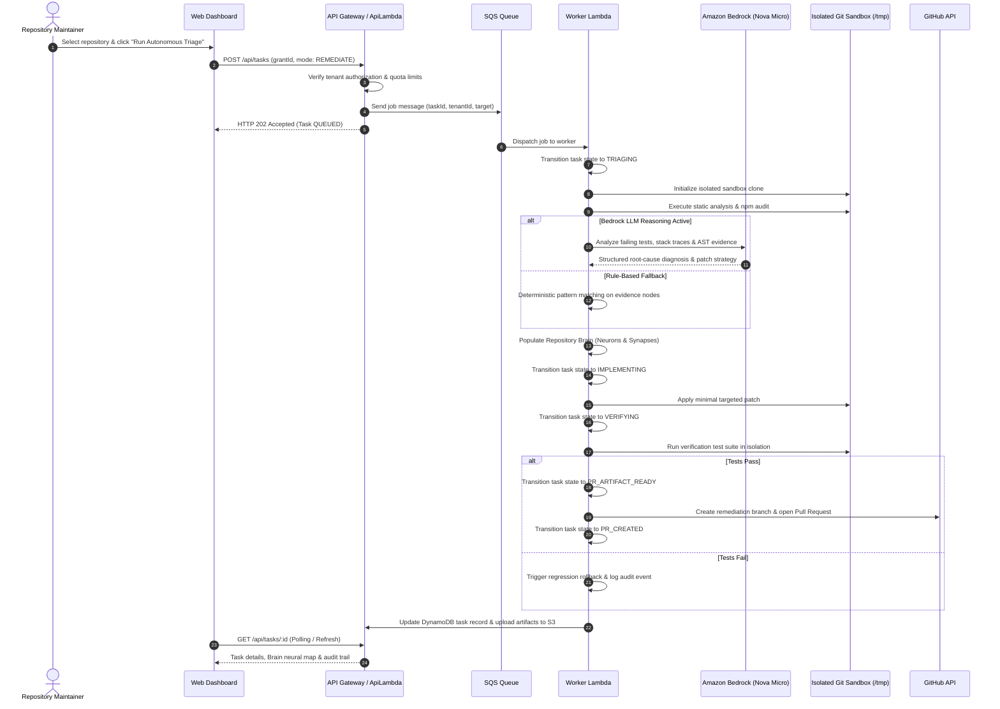
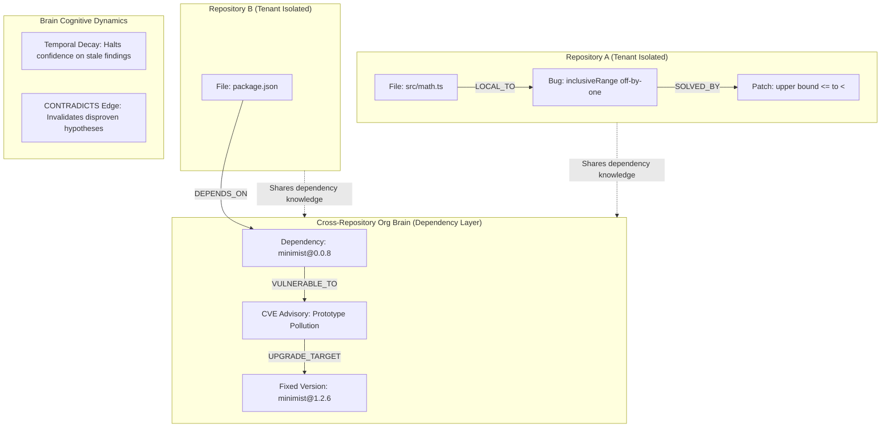

# UATU: Universal Autonomous Triage & Upkeep

**Observe. Understand. Repair. Contribute.**

UATU is an autonomous open-source maintenance and security research agent. It continuously monitors authorized software repositories, maintains a living repository Brain of codebase knowledge, triages bugs and security advisories, formulates minimal verified patches inside isolated sandboxes, and opens reviewable GitHub pull requests.

The system is deployed using a split cloud architecture: a high-performance React SPA frontend on Vercel and a least-privilege, serverless backend on AWS in the `ap-south-1` region powered by Amazon Bedrock Nova Micro, API Gateway HTTP API, Lambda with a native Git layer, SQS, DynamoDB, and S3.

---

## 1. System Architecture and Design

### Split Cloud Deployment Architecture

```mermaid
flowchart TD
    subgraph BrowserClient["Browser Client / Operator"]
        User["Developer / Repo Maintainer"]
        SPA["Vite React SPA (uatu-beta.vercel.app)"]
        User -->|Interacts with| SPA
    end

    subgraph VercelEdge["Vercel Edge Network"]
        VStatic["Static Assets & Routing (Vercel CDN)"]
        SPA -.->|Hosted on| VStatic
    end

    subgraph GitHubPlatform["GitHub Platform"]
        GHApp["GitHub App (uatu-agent)"]
        GHOAuth["GitHub OAuth Provider"]
        GHRepos["Target Repositories"]
        GHWebhooks["Webhook Dispatcher"]
    end

    subgraph AWSCloud["AWS Cloud (Region: ap-south-1)"]
        APIGW["API Gateway HTTP API (uatu-api)"]
        
        subgraph ServerlessCompute["Serverless Compute Layer"]
            ApiLambda["API Lambda (Express + Git Layer)"]
            WorkerLambda["Worker Lambda (Orchestrator + Bedrock + Git)"]
        end

        subgraph Messaging["Asynchronous Event & Job Queue"]
            JobQueue["Amazon SQS Job Queue (JobQueue)"]
            JobDLQ["Dead Letter Queue (JobDlq)"]
            EventBus["Amazon EventBridge Bus (uatu-shipit)"]
            CronRule["Daily Rescan Cron Rule"]
        end

        subgraph StoragePersistence["Storage & Data Persistence"]
            DynamoDB["Amazon DynamoDB (Tasks & Sessions)"]
            S3Artifacts["Amazon S3 Bucket (Artifacts & Diffs)"]
        end

        subgraph AIReasoning["AI Inference Layer"]
            Bedrock["Amazon Bedrock (Nova Micro: apac.amazon.nova-micro-v1:0)"]
        end
    end

    SPA -->|HTTPS / Credentialed CORS| APIGW
    APIGW -->|Proxy Integration| ApiLambda
    ApiLambda -->|Enqueue Async Tasks| JobQueue
    JobQueue -->|Event Source Mapping (Batch: 1)| WorkerLambda
    JobQueue -.->|Max Retries Exceeded| JobDLQ
    CronRule -->|Daily Trigger| JobQueue
    
    ApiLambda -->|State & Sessions| DynamoDB
    ApiLambda -->|Store Logs & Diffs| S3Artifacts
    WorkerLambda -->|State Updates| DynamoDB
    WorkerLambda -->|Upload Patches & Diffs| S3Artifacts
    WorkerLambda -->|AI Code Review & Root Cause| Bedrock
    
    SPA -->|Initiate Sign-In| GHOAuth
    GHOAuth -->|OAuth Callback| ApiLambda
    GHWebhooks -->|Signed HMAC Webhook Events| APIGW
    WorkerLambda -->|Mint Installation Token & Clone/PR| GHRepos
```

---

### Autonomous Remediation and Triage Pipeline



---

### Multi-Tenant Org Brain Architecture



---

## 2. Core Capabilities by Phase

- **Passive by Default:** Full inspection, vulnerability scanning, and Brain compilation require zero write permissions. Writes require explicit capability grants.
- **Phase D (Org Brain):** Cross-repository dependency neuron sharing with tenant boundary isolation, temporal decay algorithms for stale findings, and CONTRADICTS synapse edges.
- **Phase E (Security Research):** Capability-gated security engine requiring explicit `security-research` grant scope to prevent unauthorized code execution.
- **Phase F (Automated Rescans & Webhooks):** Scheduled daily sweeps triggered by Amazon EventBridge cron rules and timing-safe HMAC-SHA256 signature verification on GitHub webhook payloads.
- **Phase G (Automated PR Review Bot):** Autonomous PR code review bot providing detailed inline code comments and risk assessments without requiring repository merge permissions.
- **Phase K (Multi-Tenant Access & Split Cloud):** GitHub OAuth flow, HTTP-only secure cookie session management, dynamic installation access token minting, per-user daily and monthly quotas, and directory-level sandbox isolation.
- **Amazon Bedrock AI Reasoning:** Integrated live with APAC Nova Micro (`apac.amazon.nova-micro-v1:0`) in `ap-south-1`, returning structured JSON remediation plans with automatic deterministic rule fallback.
- **Multi-Model Selection & Smart Complexity Router:** Users can select specific foundation models from a live catalog, or let the autonomous Smart Complexity Router optimize model assignment by task difficulty:
  - **Low Complexity (Triage, PR Review, Action Planning):** Amazon Nova Micro (`apac.amazon.nova-micro-v1:0`, 20 RPM / 400K TPM).
  - **Medium Complexity (Dependency Audits, Code Review):** Amazon Nova Lite (`apac.amazon.nova-lite-v1:0`, 20 RPM / 400K TPM).
  - **High Complexity (Deep Root-Cause Investigation, Unified Diff Synthesis):** Amazon Nova 2 Omni (`global.amazon.nova-2-omni-v1:0`, 20 RPM / 8M TPM).
  - **User-Selectable Models:** Claude 3 Haiku, Claude Haiku 4.5, Claude 3.5 Sonnet v2, Claude Sonnet 4.5 v1, Claude Sonnet 4.6, Claude Opus 4.5, Claude Opus 4.6 v1, Meta Llama 3.2 3B Instruct, or Deterministic Rules Only.
  - **Automated Quota Cascade:** If a model hits a `ThrottlingException` (HTTP 429) or quota limit, the workflow engine automatically cascades to high-throughput secondary fallbacks and audits the cascade in the execution timeline.
  - **Per-Step Model Badges:** Every audit row and finding in the UI explicitly displays the model that powered that step (e.g. `[Nova Micro: Triage]`, `[Nova 2 Omni: Patch]`).

---

## 3. Environment Variables and Setup Guide

To run UATU either locally or in production, obtain the keys and credentials detailed below.

### Environment Variable Distribution

| Variable Name | Environment | Description |
|---|---|---|
| `VITE_UATU_API_URL` | Public Frontend (Vercel) | Full base URL of the deployed AWS API Gateway. |
| `VITE_UATU_GITHUB_APP_SLUG` | Public Frontend (Vercel) | GitHub App public URL slug for installation links. |
| `UATU_GITHUB_APP_ID` | Private Backend (AWS / Local) | GitHub App numeric App ID. |
| `UATU_GITHUB_APP_PRIVATE_KEY` | Private Backend (AWS / Local) | RSA private key in PEM format downloaded from GitHub App. |
| `UATU_GITHUB_OAUTH_CLIENT_ID` | Private Backend (AWS / Local) | Client ID generated from the GitHub OAuth App. |
| `UATU_GITHUB_OAUTH_CLIENT_SECRET`| Private Backend (AWS / Local) | Client secret generated from the GitHub OAuth App. |
| `UATU_GITHUB_OAUTH_CALLBACK_URL` | Private Backend (AWS / Local) | OAuth callback endpoint on API Gateway. |
| `UATU_GITHUB_WEBHOOK_SECRET` | Private Backend (AWS / Local) | Shared secret for timing-safe HMAC verification. |
| `UATU_BEDROCK_ENABLED` | Private Backend (AWS / Local) | Set to `true` to enable Bedrock LLM reasoning. |
| `UATU_BEDROCK_REGION` | Private Backend (AWS / Local) | AWS region for Bedrock inference (default: `ap-south-1`). |
| `UATU_BEDROCK_MODEL_ID` | Private Backend (AWS / Local) | Bedrock model identifier (`apac.amazon.nova-micro-v1:0`). |
| `UATU_WEB_ORIGIN` | Private Backend (AWS / Local) | Allowed frontend origin for CORS and session cookies. |
| `UATU_CORS_ORIGIN` | Private Backend (AWS / Local) | Allowed CORS origin (set to `https://uatu-beta.vercel.app`). |
| `UATU_COOKIE_SECURE` | Private Backend (AWS / Local) | Must be `true` in production for HTTPS cross-site cookies. |
| `UATU_COOKIE_SAMESITE` | Private Backend (AWS / Local) | Must be `None` in production for cross-origin API cookies. |

---

### Step-by-Step Key Acquisition Guide

#### 1. GitHub App (`uatu-agent`)
A GitHub App allows UATU to clone repositories, open pull requests, and comment on reviews using temporary installation tokens.

1. Go to **GitHub -> Settings -> Developer Settings -> GitHub Apps -> New GitHub App**.
2. Set **GitHub App name**: `uatu-agent` (or your chosen name).
3. Set **Homepage URL**: `https://uatu-beta.vercel.app`.
4. Set **Setup URL (redirect after install)**: `https://uatu-beta.vercel.app/onboarding/complete`. Check **Redirect on setup**.
5. Set **Webhook URL**: `https://2zq3almhy2.execute-api.ap-south-1.amazonaws.com/api/webhooks/github`.
6. Set **Webhook secret**: Generate a random 32-byte hex string (e.g. `openssl rand -hex 32`) and save as `UATU_GITHUB_WEBHOOK_SECRET`.
7. Configure **Permissions**:
   - **Repository -> Contents**: Read and write (for reading code and creating remediation branches).
   - **Repository -> Pull requests**: Read and write (for opening PRs and adding comments).
   - **Repository -> Issues**: Read and write (for issue ingestion).
   - **Repository -> Metadata**: Read-only (mandatory).
8. Subscribe to **Events**:
   - Check `Push`, `Pull request`, `Issues`, `Installation`, and `Installation repositories`.
9. Click **Create GitHub App**:
   - Note the numeric **App ID** displayed on the App settings page -> `UATU_GITHUB_APP_ID`.
   - Scroll down to **Private keys**, click **Generate a private key**, and save the downloaded `.pem` file contents -> `UATU_GITHUB_APP_PRIVATE_KEY`.
10. Click **Install App** in the sidebar to install it on your personal account or target organization.

#### 2. GitHub OAuth App (User Authentication)
The OAuth App allows users to log into the UATU web dashboard with their personal GitHub identity.

1. Go to **GitHub -> Settings -> Developer Settings -> OAuth Apps -> New OAuth App**.
2. Set **Application name**: `UATU Sign-In`.
3. Set **Homepage URL**: `https://uatu-beta.vercel.app`.
4. Set **Authorization callback URL**: `https://2zq3almhy2.execute-api.ap-south-1.amazonaws.com/auth/github/callback`.
5. Click **Register application**.
6. Copy the **Client ID** -> `UATU_GITHUB_OAUTH_CLIENT_ID`.
7. Click **Generate a new client secret** and copy the resulting string -> `UATU_GITHUB_OAUTH_CLIENT_SECRET`.

#### 3. Personal Access Token (PAT) - Optional
A Classic or Fine-Grained Personal Access Token can be used as an alternative for local CLI demo runs without GitHub App configuration.

1. Go to **GitHub -> Settings -> Developer Settings -> Personal access tokens -> Tokens (classic)**.
2. Click **Generate new token (classic)**.
3. Select scopes: `repo` (Full control of private repositories) and `workflow`.
4. Copy the generated token -> `UATU_GITHUB_TOKEN`.
5. Set `UATU_GITHUB_REPO=owner/repo` and `UATU_GITHUB_BASE_BRANCH=main`.

#### 4. AWS Credentials and Amazon Bedrock Access
1. Configure your local AWS CLI credentials profile (e.g. `erebuzzz` or default) via `aws configure` or AWS SSO.
2. In the AWS Management Console for region `ap-south-1`, navigate to **Amazon Bedrock -> Model access**.
3. Enable access for **Amazon Nova Micro** (inference profile: `apac.amazon.nova-micro-v1:0`).
4. Ensure your local profile has permissions to run CDK deployments.

---

## 4. Local Development and Testing

### Prerequisites
- Node.js 20+
- Git on system `PATH`
- AWS CLI configured (optional, for cloud sync/deploy)

### Installation

```bash
git clone https://github.com/Erebuzzz/Universal-Autonomous-Triage-and-Upkeep.git
cd Universal-Autonomous-Triage-and-Upkeep
npm install
npm run build -w @uatu/domain && npm run build -w @uatu/core
```

### Running the End-to-End Headless Demo

```bash
npm run demo
```

The demo copies `fixtures/demo-vulnerable` into an isolated sandbox at `data/sandbox/demo-vulnerable` (with its own isolated `.git` repository), executes static defect detection and vulnerability auditing, formulates a verified fix, and outputs a complete pull request artifact with zero risk to your parent monorepo.

### Starting Local Development Servers

```bash
# Terminal 1: Start API server on http://localhost:8787
npm run dev:api

# Terminal 2: Start Vite web dashboard on http://localhost:5173
npm run dev:web
```

### Running Automated Test Suites

```bash
# Run all unit and integration tests (34 tests across 4 packages)
npm test

# Run TypeScript typechecks across the entire monorepo
npm run typecheck
```

---

## 5. Cloud Deployment

### 1. AWS CDK Deployment (`infra/cdk`)

The AWS infrastructure is defined using AWS CDK in TypeScript. It provisions:
- API Gateway HTTP API with CORS credentials support.
- Lambda API with bundled dependencies and a pre-packaged Git layer (`git-lambda2`).
- SQS Worker Lambda with 5-minute timeout and dead-letter queue.
- DynamoDB table with point-in-time recovery for task states, user sessions, and audit events.
- S3 bucket with versioning and AES-256 encryption for patch artifacts.
- EventBridge rule triggering automated 24-hour rescans.

To deploy:

```powershell
cd infra/cdk
npx cdk deploy --require-approval never --profile erebuzzz
```

### 2. Vercel Frontend Deployment (`apps/web`)

The frontend is deployed to Vercel and configured to communicate securely with the API Gateway:

```powershell
# Deploy to Vercel production
vercel --prod --yes
```

---

## 6. Live Deployed Endpoints

| Service | Target URL |
|---|---|
| **Production Web Dashboard** | [https://uatu-beta.vercel.app](https://uatu-beta.vercel.app) |
| **Interactive In-App Documentation** | [https://uatu-beta.vercel.app/docs](https://uatu-beta.vercel.app/docs) |
| **API Gateway Health Check** | [https://2zq3almhy2.execute-api.ap-south-1.amazonaws.com/health](https://2zq3almhy2.execute-api.ap-south-1.amazonaws.com/health) |
| **GitHub OAuth Sign-In Endpoint** | [https://2zq3almhy2.execute-api.ap-south-1.amazonaws.com/auth/github](https://2zq3almhy2.execute-api.ap-south-1.amazonaws.com/auth/github) |
| **GitHub App Post-Install Setup URL** | [https://uatu-beta.vercel.app/onboarding/complete](https://uatu-beta.vercel.app/onboarding/complete) |
| **GitHub Webhook Ingestion Receiver** | [https://2zq3almhy2.execute-api.ap-south-1.amazonaws.com/api/webhooks/github](https://2zq3almhy2.execute-api.ap-south-1.amazonaws.com/api/webhooks/github) |

---

## 7. Monorepo Package Structure

```text
├── apps/
│   ├── api/          # Express HTTP API, OAuth handshake, SQS worker, quota engine
│   └── web/          # React SPA, neural Brain map, operator dashboard, docs reader
├── packages/
│   ├── domain/       # Shared TypeScript types, state machine, transition rules
│   └── core/         # Repository Brain, policy engine, static & LLM detection, PR bot
├── infra/
│   └── cdk/          # AWS CDK stack (API Gateway, Lambda, SQS, DynamoDB, S3)
├── fixtures/
│   └── demo-vulnerable/  # Sandboxed vulnerable repository for verified test cases
└── docs/             # In-depth architectural guides and deployment runbooks
```

---

## 8. License

This project is licensed under the [MIT License](./LICENSE).
