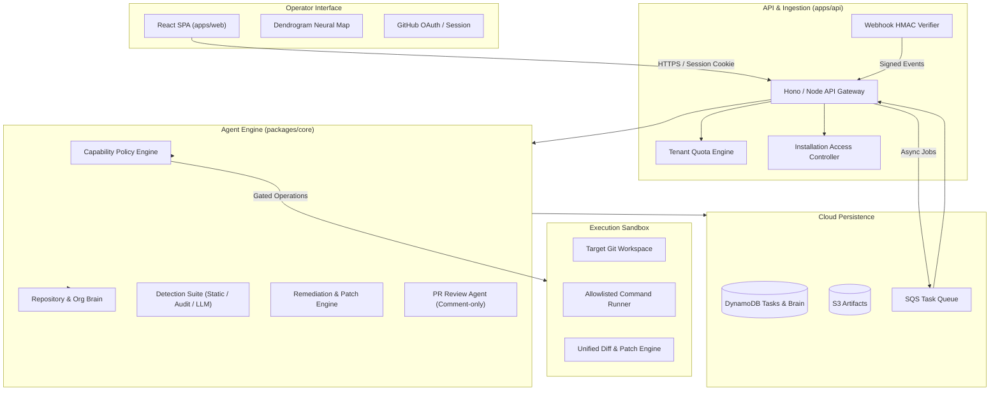

# UATU Codebase Technical Review

## 1. Executive Summary

UATU (Universal Autonomous Triage & Upkeep) is an autonomous software maintenance and security upkeep agent. This review covers the full monorepo implementation spanning domain models, core knowledge and policy engines, detection and remediation pipelines, API services, web visualization, and AWS CDK infrastructure.

The architecture emphasizes safety first: no writes occur without explicit grants, all actions execute in isolated sandbox paths, sensitive tokens are redacted at boundaries, and all code changes are verified against test suites before pull request artifacts are generated.

---

## 2. Package-by-Package Review

### 2.1 `@uatu/domain`

- **Purpose**: Defines pure TypeScript domain contracts, status enumerations, and the formal task state machine.
- **Key Artifacts**:
  - `OperatingMode`: PASSIVE, RESEARCH, TRIAGE, MAINTAIN, SECURITY, REMEDIATE, WATCH.
  - `Capability`: inspect, analyze, run_tests, write_files, create_branch, commit, draft_pr, security_research.
  - `TaskState` and `LEGAL_TRANSITIONS`: A strictly typed finite state machine covering DISCOVERED through PR_CREATED.
  - `NeuronKind` and `EdgeKind`: 12 neuron varieties and 11 relationship types.
- **Review Observations**:
  - The state machine prevents invalid jumps (for example, attempting to implement without root cause verification).
  - No external runtime dependencies; acts as an immutable boundary.
  - Clean typing allows compile-time guarantees across both frontend and backend.

### 2.2 `@uatu/core`

- **Brain & Knowledge Graph (`brain.ts`)**:
  - Manages in-memory and persisted graphs of nodes (`Neuron`) and relationships (`Synapse`).
  - Implements Organization Brain logic where shared `Dependency` neurons connect across repositories belonging to the same organization. When multiple repositories use the same dependency with vulnerabilities, confidence is elevated dynamically.
  - Applies temporal decay (`applyTemporalDecay`) to stale knowledge so past findings that have not been observed recently lose confidence over time.
  - Generates contradiction edges (`CONTRADICTS`) when new observations conflict with previous hypotheses.
- **Policy Engine (`policy.ts`)**:
  - Enforces least privilege. Capabilities are checked before any filesystem write, branch creation, or test execution.
  - Sandboxing: Ensures all filesystem target paths remain within the authorized root. Rejects directory traversal attempts.
  - Command allowlist: Only pre-approved test and build commands can be executed. Rejects shell injection patterns.
  - Security scope gating: The `security_research` capability is rejected unless the grant explicitly holds the `security-research` scope.
  - Redaction: `redactSecrets` masks GitHub tokens, private keys, and credential headers from logs and audit events.
- **Detection Suite (`src/detection/`)**:
  - `general-detect.ts`: Runs static analysis and npm audit to detect real syntax bugs, unhandled exceptions, and dependency vulnerabilities.
  - `static-analysis.ts`: AST and regex scanners targeting hardcoded credentials, insecure regexes, and known bug patterns while skipping test files.
  - `npm-audit.ts`: Parses npm audit JSON, extracts package advisories, and formats actionable remediation hints.
  - `llm-code-review.ts`: Leverages Amazon Bedrock (or rule fallback) to reason over changed files and generate candidate unified diffs.
  - `apply-unified-diff.ts`: Clean line-based parser that applies multi-hunk unified diffs safely without calling external patch binaries.
- **Workflow & PR Bot (`workflow.ts`, `pr-review.ts`)**:
  - Orchestrates the full triage -> investigate -> implement -> test -> verify -> PR loop.
  - Produces structured `PrReadyArtifact` containing commit messages, diff summaries, and human-readable explanations.
  - `pr-review.ts` acts as an automated reviewer on GitHub PR webhooks, adding structured feedback comments while strictly omitting merge permissions.

### 2.3 `@uatu/api`

- **Authentication & Multi-Tenancy (`auth.ts`, `installation-access.ts`)**:
  - Implements GitHub OAuth with state verification and httpOnly session cookies.
  - Supports multi-tenant GitHub App installations. Tokens are minted on-demand using short-lived installation access tokens.
  - Enforces tenant isolation: all grants, tasks, and brain partitions include a `userId` namespace.
- **Webhook Security (`webhook-hmac.ts`)**:
  - Cryptographically verifies GitHub webhook payloads using HMAC-SHA256 with timing-safe comparison (`crypto.timingSafeEqual`).
  - Unsigned or incorrectly signed webhooks return immediate 401 Unauthorized responses.
- **Usage Quotas (`quota.ts`)**:
  - Tracks concurrent runs, daily runs, and monthly runs per user.
  - Enforces execution wall-clock timeouts to prevent runaway processes.
- **Dual Execution (HTTP + Lambda Worker)**:
  - Supports both direct Node HTTP execution for local development and AWS SQS + Lambda worker processing for production cloud operation.

### 2.4 `@uatu/web`

- **Architecture**:
  - Vite React SPA with client-side path routing (no external router bloat).
  - Clean separation between presentation components and API transport (`api.ts`).
- **Neural Map Visualizer (`BrainMapView.tsx`)**:
  - Tidy-tree dendrogram layout mapping repositories, directories, files, bugs, and patches.
  - Orthogonal elbow routing avoids overlapping visual clutter.
  - Interactive activation states, hover tooltips, and node focus isolate subsystems during investigation.
- **Operator Dashboard (`Dashboard.tsx`)**:
  - Stepped workflow indicator (Authorize, Start, Inspect, Run, Review PR).
  - Triage finding selection with severity badges and path hints.
  - Real-time audit trail inspector and PR artifact body viewer.

### 2.5 `@uatu/infra`

- **Cloud Infrastructure (`infra/cdk`)**:
  - AWS CDK stack synthesizing API Gateway HTTP API, Lambda API with Git layer, SQS job queue with DLQ, DynamoDB tasks table, and S3 artifact bucket.
  - Clean environment segregation: secrets remain exclusively in Lambda environment variables and AWS Secrets Manager.
  - Front-end hosting configured for Vercel with strict CORS credentials and SameSite cookie options.

---

## 3. Security & Safety Evaluation

| Area | Implementation | Status |
|------|----------------|--------|
| **Authorization Boundaries** | Explicit grants required before writes; path and command allowlists | Verified |
| **Multi-Tenant Isolation** | Storage keys prefixed with tenant IDs; authenticated routes filter by user | Verified |
| **Secret Management** | Tokens redacted from errors and logs; Git URLs use HTTP auth headers | Verified |
| **Webhook Ingestion** | Timing-safe HMAC-SHA256 signature verification | Verified |
| **Command Injection Guard** | Shell commands verified against strict command templates | Verified |
| **PR Merge Safety** | PR bot operates purely in comment mode; merge capability omitted | Verified |

---

## 4. Test Coverage & Verification

- **Total Test Suites**: 4 suites (Domain, Core, API, Infra).
- **Total Tests**: 34 unit and integration tests passing.
- **Type Checking**: 0 errors across all 4 projects under strict TypeScript configurations.
- **Automated Verification**: End-to-end remediation test simulates a real repository defect, creates an isolated sandbox, implements a patch, runs test suites, verifies the fix, and confirms PR artifact readiness.

---

## 5. Architectural Recommendations for Next Milestones

1. **Integrated In-App Documentation**: Replace raw static markdown links with an in-app documentation viewer component so operators do not leave the app.
2. **Real-Time Streaming**: Introduce Server-Sent Events (SSE) or WebSockets to stream log steps and Brain graph activations in real-time during worker execution.
3. **Multi-Agent Coordination (Phase H)**: Transition complex, multi-repository tasks to AWS Step Functions for resilient distributed step execution.
4. **Vector Knowledge Search**: Augment the keyword and graph Brain with embeddings (via Amazon Titan / OpenSearch) for semantic similarity searches across large codebases.
