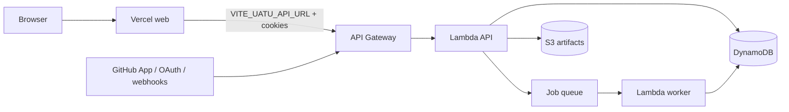

# Deployment guide (production demo)

Split deploy: **Vercel** hosts `apps/web`, **AWS** (API Gateway + Lambda + SQS worker + DynamoDB + S3) hosts the API and secrets.



## Existing Ship It stack (if already deployed)

From a prior deploy in **ap-south-1** (confirm Region in AWS Settings):

| Output | Value |
|--------|-------|
| ApiUrl | `https://2zq3almhy2.execute-api.ap-south-1.amazonaws.com` |
| Web (Vercel) | `https://uatu-beta.vercel.app` |
| JobQueueUrl / TasksTable / ArtifactBucket | CDK stack outputs |

`GET {ApiUrl}/health` should return `ok: true`. After wiring OAuth/App secrets on Lambda, also expect `oauthConfigured` / `githubAppConfigured` (local API already does).

Re-check with:

```bash
cd infra/cdk
npx cdk deploy --outputs-file ../../data/cdk-outputs.json
```

Do **not** commit `data/cdk-outputs.json` if it ever contains secrets (it usually does not).

## Vercel (`apps/web`)

1. Import the monorepo (or deploy from `apps/web`).
2. Root directory: `apps/web` (see `apps/web/vercel.json`).
3. Environment variables (Production + Preview):

| Name | Value | Notes |
|------|-------|-------|
| `VITE_UATU_API_URL` | `https://<api-gw-id>.execute-api.<region>.amazonaws.com` | No trailing slash |
| `VITE_UATU_GITHUB_APP_SLUG` | `uatu-agent` | Optional; install button |

### Never put these on Vercel

- `UATU_GITHUB_APP_PRIVATE_KEY`
- `UATU_GITHUB_APP_ID` (App JWT minting)
- `UATU_GITHUB_OAUTH_CLIENT_SECRET`
- `UATU_GITHUB_WEBHOOK_SECRET`
- Bedrock / AWS access keys

`VITE_*` vars are **bundled into the browser**. A private key in VITE would be public forever.

## AWS Lambda environment (API + worker)

Set on **both** API and worker functions (CDK `sharedEnv` + console overrides):

| Name | Purpose |
|------|---------|
| `UATU_AUTH_REQUIRED` | `true` in production |
| `UATU_CORS_ORIGIN` / `UATU_WEB_ORIGIN` | Exact Vercel origin, e.g. `https://uatu.vercel.app` |
| `UATU_CORS_CREDENTIALS` | `true` |
| `UATU_COOKIE_SECURE` | `true` |
| `UATU_COOKIE_SAMESITE` | `None` (cross-site Vercel → API) |
| `UATU_GITHUB_APP_ID` | GitHub App id |
| `UATU_GITHUB_APP_PRIVATE_KEY` | PEM (multiline OK in Lambda console / Secrets Manager) |
| `UATU_GITHUB_OAUTH_CLIENT_ID` | OAuth App client id |
| `UATU_GITHUB_OAUTH_CLIENT_SECRET` | OAuth App secret |
| `UATU_GITHUB_OAUTH_CALLBACK_URL` | `https://<ApiUrl>/auth/github/callback` |
| `UATU_GITHUB_WEBHOOK_SECRET` | Same string as GitHub App webhook secret |
| `UATU_BEDROCK_ENABLED` / `UATU_BEDROCK_MODEL_ID` | Optional agentic core |
| `TASKS_TABLE` / `ARTIFACT_BUCKET` / `JOB_QUEUE_URL` | From CDK |

CORS must list the **exact** Vercel origin (not `*`) when using cookies.

## After deploy: GitHub App checklist

See [GITHUB_APP.md](./GITHUB_APP.md).

## Local recording fallback (always works)

```bash
# Terminal 1
set UATU_AUTH_REQUIRED=false
npm run dev -w @uatu/api

# Terminal 2
npm run dev -w @uatu/web

# Or one-shot fixture
set UATU_AUTH_REQUIRED=false
set UATU_DETECTION_MODE=auto
npm run demo
```

Fixture path: authorize demo → start run → select finding → run to `PR_ARTIFACT_READY`.
